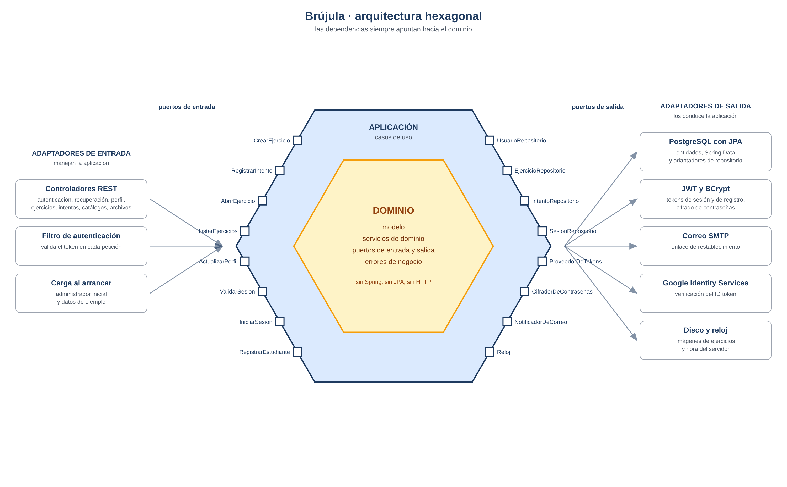
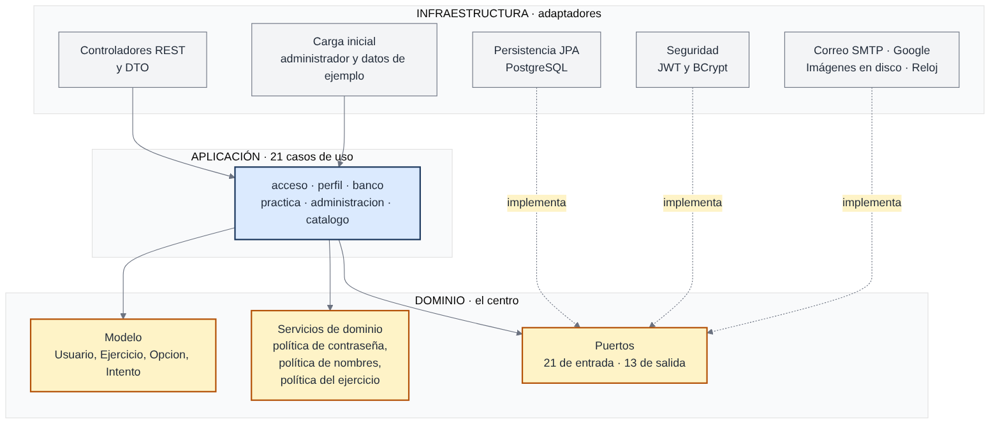
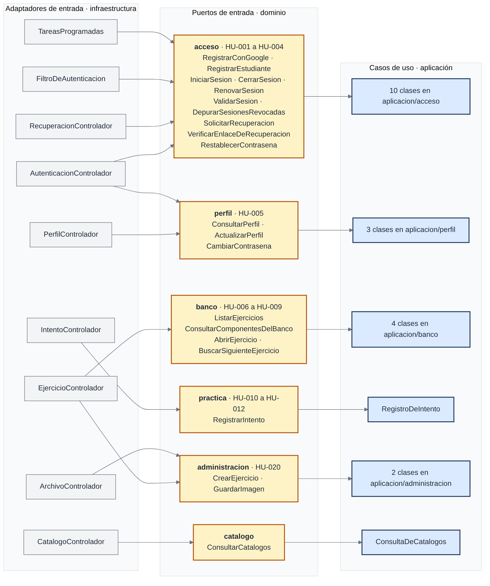
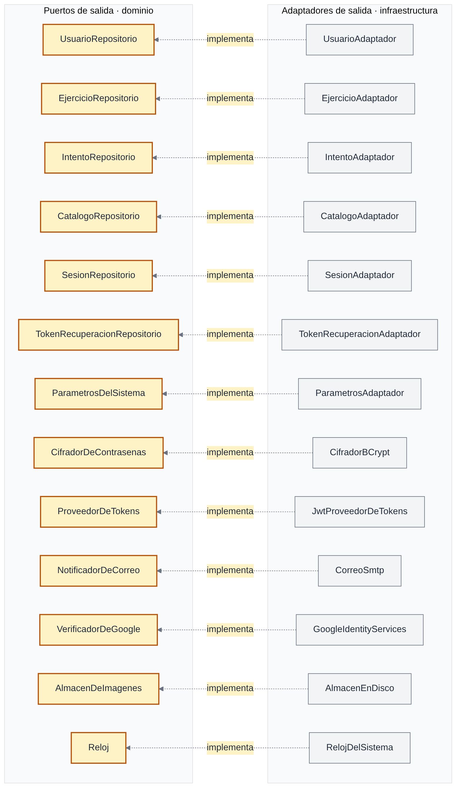
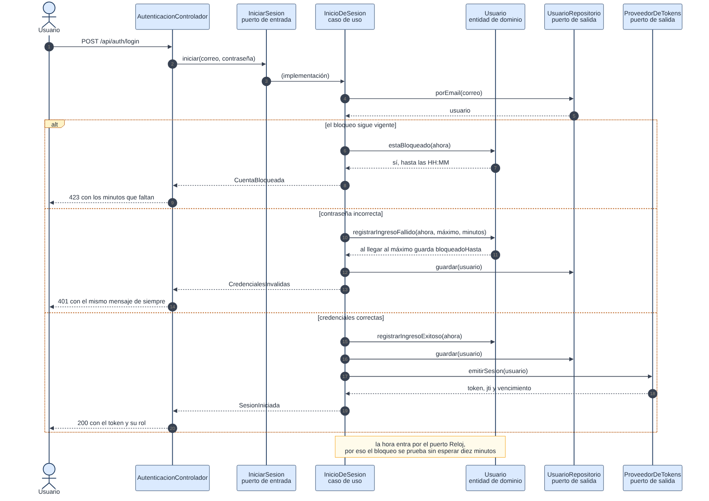
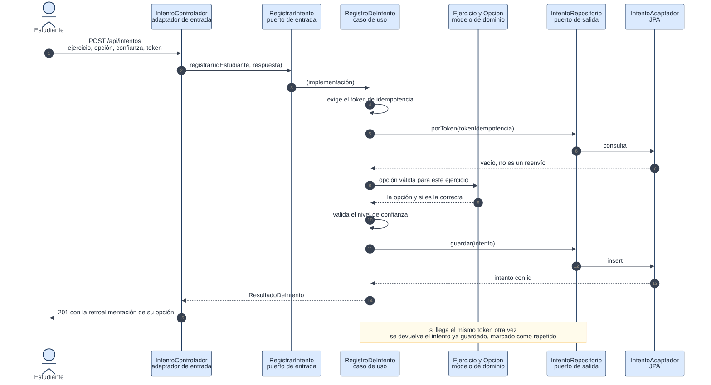
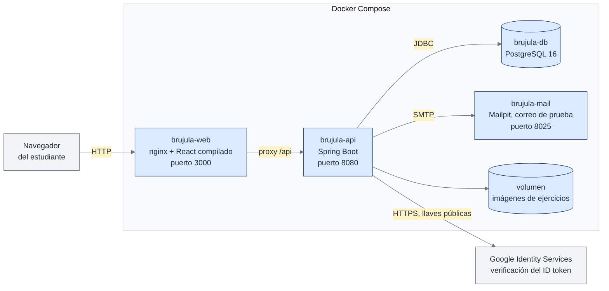

# Arquitectura de Brújula

Brújula prepara a un estudiante de colegio para la prueba Saber 11 en matemáticas. Lo que
la distingue de un banco de preguntas cualquiera es que, al fallar, le explica **por qué se
equivocó según la opción que eligió**, y le pide declarar qué tan seguro estaba antes de
responder.

Este documento describe lo que hay en `main`, que es el alcance del **Sprint 1**: acceso y
cuenta, banco de ejercicios y el ciclo de resolver con retroalimentación, más la creación
de ejercicios por parte del administrador. Los simulacros, las estadísticas, el historial,
la edición del banco y la clasificación del tipo de error están construidos y viven en la
rama `sprint-2`; entran a `main` cuando llegue su sprint.

## De un vistazo



El dominio está en el centro y no sabe que existen Spring, PostgreSQL ni HTTP. Todo lo que
necesita del mundo lo declara como una interfaz, y alguien de afuera la cumple. Cambiar de
base de datos o de framework web es escribir otro adaptador.

## Las tres capas



| Capa | Archivos | Qué contiene |
| :-- | --: | :-- |
| `dominio` | 62 | Modelo con comportamiento, reglas puras, puertos y errores de negocio |
| `aplicacion` | 21 | Los casos de uso, uno por acción del usuario |
| `infraestructura` | 53 | Controladores, JPA, seguridad, correo, Google, disco y reloj |

La regla es una sola: **las dependencias apuntan hacia adentro**. Y no se queda en la
promesa: `ArquitecturaTest` lee los imports del proyecto y falla si alguien la rompe. Son
siete reglas verificadas en cada compilación.

- el dominio no importa ningún framework;
- el dominio no conoce a las capas de afuera;
- la aplicación no depende de la infraestructura;
- ningún caso de uso depende de otro caso de uso;
- cada caso de uso implementa exactamente un puerto de entrada;
- solo el adaptador de reloj pregunta la hora del sistema;
- el código no lleva comentarios.

## Los casos de uso



Un caso de uso es una acción del usuario, no un módulo. Por eso `IniciarSesion`,
`CerrarSesion` y `RenovarSesion` son tres clases y no tres métodos de la misma. El puerto se
nombra con un verbo en infinitivo y la clase que lo implementa con un sustantivo.

| Puerto de entrada | Caso de uso | Historia | Ruta |
| :-- | :-- | :-- | :-- |
| `RegistrarConGoogle` | `acceso/RegistroConGoogle` | HU-001 | `POST /api/auth/google` |
| `RegistrarEstudiante` | `acceso/RegistroDeEstudiante` | HU-001 | `POST /api/auth/registro` |
| `IniciarSesion` | `acceso/InicioDeSesion` | HU-002 | `POST /api/auth/login` |
| `CerrarSesion` | `acceso/CierreDeSesion` | HU-004 | `POST /api/auth/logout` |
| `RenovarSesion` | `acceso/RenovacionDeSesion` | HU-004 | `POST /api/auth/refresh` |
| `ValidarSesion` | `acceso/ValidacionDeSesion` | HU-004 | el filtro, en cada petición |
| `DepurarSesionesRevocadas` | `acceso/DepuracionDeSesionesRevocadas` | HU-004 | tarea programada |
| `SolicitarRecuperacion` | `acceso/SolicitudDeRecuperacion` | HU-003 | `POST /api/auth/recuperar` |
| `VerificarEnlaceDeRecuperacion` | `acceso/VerificacionDelEnlaceDeRecuperacion` | HU-003 | `GET /api/auth/restablecer/validar` |
| `RestablecerContrasena` | `acceso/RestablecimientoDeContrasena` | HU-003 | `POST /api/auth/restablecer` |
| `ConsultarPerfil` | `perfil/ConsultaDePerfil` | HU-005 | `GET /api/auth/me` |
| `ActualizarPerfil` | `perfil/ActualizacionDelPerfil` | HU-005 | `PUT /api/perfil` |
| `CambiarContrasena` | `perfil/CambioDeContrasena` | HU-005 | `PUT /api/perfil/password` |
| `ListarEjercicios` | `banco/ListadoDeEjercicios` | HU-006, HU-007, HU-008 | `GET /api/ejercicios` |
| `ConsultarComponentesDelBanco` | `banco/ConsultaDeComponentesDelBanco` | HU-007 | `GET /api/ejercicios/componentes` |
| `AbrirEjercicio` | `banco/AperturaDeEjercicio` | HU-009 | `GET /api/ejercicios/{id}` |
| `BuscarSiguienteEjercicio` | `banco/BusquedaDelSiguienteEjercicio` | HU-009 | `GET /api/ejercicios/{id}/siguiente` |
| `RegistrarIntento` | `practica/RegistroDeIntento` | HU-010, HU-011, HU-012 | `POST /api/intentos` |
| `CrearEjercicio` | `administracion/CreacionDeEjercicio` | HU-020 | `POST /api/ejercicios` |
| `GuardarImagen` | `administracion/GuardadoDeImagen` | HU-020 | `POST /api/archivos` |
| `ConsultarCatalogos` | `catalogo/ConsultaDeCatalogos` | HU-020 | `GET /api/catalogos` |

## Lo que el sistema necesita del mundo



Trece puertos de salida. Siete son repositorios y seis no: el reloj, los parámetros del
sistema, el cifrador, el proveedor de tokens, el notificador de correo, el verificador de
Google y el almacén de imágenes. Aquí está la inversión que da nombre a la arquitectura: el
dominio declara la interfaz en su propio vocabulario y la base de datos la cumple, no al
revés.

## Decisiones propias de este proyecto

Estas no salen del libro; salen de nuestras historias de usuario y son las que conviene
poder defender.

**El bloqueo guarda el final, no el principio.** Cuando un usuario agota sus intentos,
`Usuario` calcula y guarda `bloqueadoHasta = ahora + minutos`. Comprobar si sigue bloqueado
es una comparación contra el reloj, no una suma que hay que repetir en cada consulta. La
entidad distingue además "el castigo ya pasó" de "nunca estuvo bloqueada", para que un
intento fallido a medias no reinicie el contador por accidente.

**La hora entra por un puerto.** Ninguna regla llama a `Instant.now()`; lo prohíbe una
prueba de arquitectura. Suena exagerado hasta que hay que verificar un bloqueo de diez
minutos o la vigencia de media hora de un enlace: con el reloj falso se adelanta el tiempo
y listo.

**Los umbrales viven en la base de datos.** Los cinco intentos, los diez minutos de
bloqueo, las dos horas de sesión, los treinta minutos del enlace, las tres solicitudes por
hora y las veinte tarjetas por página están en `parametros_sistema` y se leen en cada uso.
Cambiar uno es un `UPDATE`, no un despliegue.

**Tres políticas, tres responsabilidades.** `PoliticaDeContrasena` revisa contraseñas,
`PoliticaDeNombres` revisa nombre y apellido y `PoliticaDelEjercicio` revisa lo que se
puede saber de un ejercicio sin ir a la base. Antes las dos primeras vivían juntas porque
salían del mismo criterio de aceptación; el criterio es una unidad de negocio, no una
unidad de diseño.

**Responder es idempotente y el token es obligatorio.** El navegador genera un
identificador antes de enviar la respuesta. Si la conexión se cae y reintenta, se devuelve
el intento que ya quedó, marcado como repetido. La unicidad está en la base y el adaptador
captura la violación por si dos envíos llegan al mismo tiempo.

**El estudiante no puede ver la respuesta correcta antes de responder.** No es un `if` en
el controlador: son dos modelos de lectura distintos. El que sirve la pantalla de práctica
sencillamente no tiene el campo. Lo que no existe en el objeto no se puede filtrar en el
JSON.

**El correo no se puede cambiar, y no hay una validación que lo diga.** El método
`actualizarDatosPersonales` de `Usuario` solo toca nombre y apellido. La regla se cumple
por diseño.

**Cambiar la contraseña cierra todas las sesiones.** Cada token lleva su fecha de emisión y
`ValidacionDeSesion` lo rechaza si es anterior al último cambio de contraseña. Aplica tanto
al restablecimiento por correo como al cambio desde el perfil.

## Dos recorridos completos

**Iniciar sesión**, con sus tres caminos. Sirve para explicar por qué el mensaje de error es
siempre el mismo exista o no la cuenta.



**Responder un ejercicio**, de la pantalla a la base y de vuelta.



## La base de datos

Once tablas, dos migraciones de Flyway y ningún comentario: la intención va en el nombre de
cada restricción. Hibernate arranca en `validate`, así que el esquema lo define el SQL y
nunca las anotaciones.

```
roles · usuarios · tokens_recuperacion · tokens_sesion_revocados
componentes · competencias · niveles_dificultad
ejercicios · opciones_respuesta · intentos · parametros_sistema
```

Tres decisiones que vale la pena mirar:

- **"Exactamente una opción correcta" se garantiza en la base.** Un índice único parcial
  impide la segunda correcta en el momento de insertarla, y un *constraint trigger* diferido
  exige al confirmar la transacción que haya una, ni cero ni dos. Así no pasa un ejercicio
  sin respuesta correcta aunque alguien escriba SQL a mano.
- **Un intento no puede apuntar a la opción de otro ejercicio.** La llave foránea es
  compuesta, `(id_opcion_seleccionada, id_ejercicio)`, contra una unicidad del mismo par en
  `opciones_respuesta`.
- **El correo es único sin distinguir mayúsculas**, por un índice sobre `lower(email)`.

## Despliegue



Cuatro contenedores: el front servido por nginx, la API, PostgreSQL y Mailpit para ver los
correos en desarrollo. Las imágenes de los ejercicios viven en un volumen.

## Pruebas

110 pruebas, todas sin base de datos, sin Spring y sin librerías de dobles: los dobles son
clases en memoria escritas a mano que implementan los puertos.

| Dónde | Archivos | Qué verifican |
| :-- | --: | :-- |
| `aplicacion/` | 21 | Un archivo por caso de uso |
| `dominio/servicio/` | 3 | Las tres políticas |
| raíz | 1 | Las siete reglas de arquitectura |

```bash
./mvnw test
```

## Regenerar los diagramas

Los cinco diagramas de Mermaid se editan en `docs/diagramas/*.mmd` y el hexágono lo dibuja
un script de Python, porque Mermaid no sabe hacer esa forma: para cambiarle un puerto basta
con editar una lista al comienzo de `docs/generar_hexagono.py`.

```bash
./docs/generar-diagramas.sh
```

Necesita Node, Python 3 y Chromium. Si el navegador está en otra ruta:
`CHROMIUM=/ruta/a/chromium ./docs/generar-diagramas.sh`.
