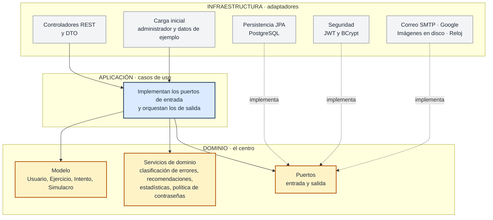
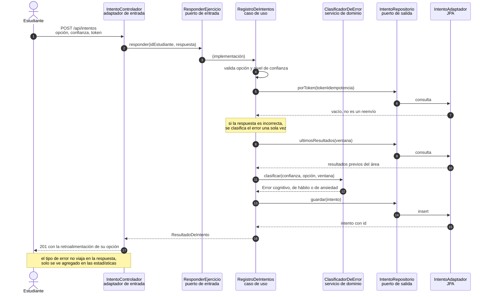
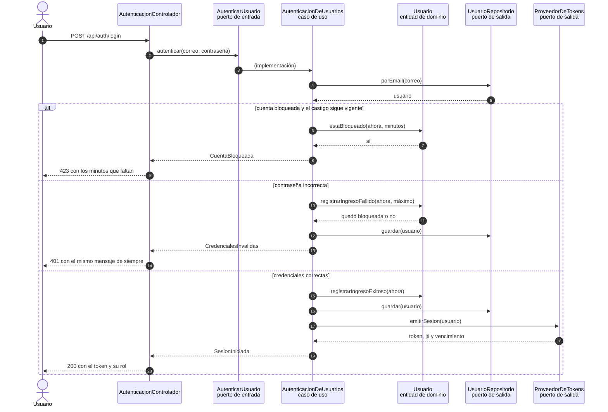
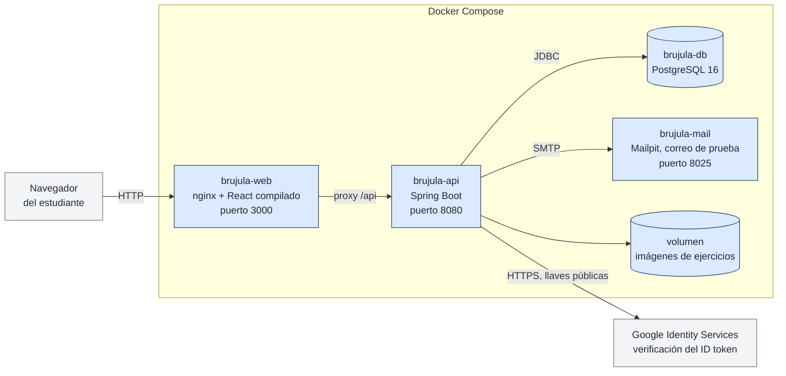

# Arquitectura de Brújula

Documento de arquitectura de la API. Los diagramas se ven directamente en GitHub y también están
exportados en [`docs/imagenes/`](imagenes/), en PNG para leerlos aquí y en SVG para el informe o la
presentación, donde conviene que no se pixelen.

La API está construida en **arquitectura hexagonal**, también llamada de puertos y adaptadores. La
idea de fondo es sencilla: las reglas del negocio no deben depender de Spring, de la base de datos ni
de HTTP. Al revés, esas tecnologías se enchufan al dominio a través de interfaces.

---

## 1. Vista general: puertos y adaptadores


En el centro está el **dominio**, que no importa una sola clase del framework: ahí viven el modelo
(Usuario, Ejercicio, Intento, Simulacro), las reglas puras y los **puertos**, que son interfaces.

Alrededor está la **aplicación**, con un caso de uso por historia de usuario. Un caso de uso
implementa un puerto de entrada y, para lo que necesita del mundo exterior, llama a puertos de salida
sin saber quién los implementa.

Por fuera quedan los **adaptadores**:

- Los de la izquierda **manejan** la aplicación: llegan de afuera y llaman a un puerto de entrada. Son
  los controladores REST, el filtro que valida el token y la carga inicial al arrancar.
- Los de la derecha son **conducidos** por la aplicación: implementan un puerto de salida. Son la
  persistencia con JPA, el emisor de tokens, el envío de correo, la verificación con Google, el
  almacenamiento de imágenes y el reloj.

---

## 2. Las tres capas y la regla de dependencias



Las flechas siempre apuntan hacia adentro: `infraestructura → aplicación → dominio`. El dominio no
conoce a nadie. Que la persistencia aparezca apuntando a los puertos y no al revés es lo que se llama
inversión de dependencias, y es lo que permite cambiar de base de datos escribiendo otro adaptador.

Esta regla no se queda en el papel: `ArquitecturaTest` lee los imports de cada archivo y falla la
compilación si el dominio empieza a depender del framework o si un caso de uso llama directamente a
un adaptador.

---

## 3. Puertos de entrada: un caso de uso por historia


Cada historia de usuario del alcance de PI1 entra por su propio puerto. Los controladores no
contienen lógica: reciben la petición, la convierten en un comando y llaman al puerto.

| Puerto de entrada | Caso de uso que lo implementa | Historias |
| :-- | :-- | :-- |
| `RegistrarEstudiante` | `RegistroDeEstudiantes` | HU-001 |
| `AutenticarUsuario` | `AutenticacionDeUsuarios` | HU-002 |
| `RecuperarContrasena` | `RecuperacionDeContrasena` | HU-003 |
| `GestionarSesion`, `ValidarSesion` | `SesionesDeUsuario` | HU-004 |
| `GestionarPerfil` | `PerfilDeUsuario` | HU-005 |
| `ConsultarBanco`, `ConsultarEjercicio`, `BuscarSiguienteEjercicio` | `BancoDeEjercicios` | HU-006 a HU-010 |
| `ResponderEjercicio`, `ConsultarHistorialDeIntentos` | `RegistroDeIntentos` | HU-010 a HU-012, HU-014, HU-016, HU-025, HU-027, HU-028 |
| `GestionarSimulacro` | `Simulacros` | HU-013 a HU-018, HU-026 |
| `ConsultarEstadisticas` | `EstadisticasDelEstudiante` | HU-019, HU-029 |
| `AdministrarEjercicios`, `GuardarImagen` | `AdministracionDeEjercicios` | HU-020 a HU-024 |
| `ConsultarCatalogos` | `ConsultaDeCatalogos` | catálogos de apoyo |

---

## 4. Puertos de salida y sus adaptadores


Son quince interfaces declaradas en el dominio, cada una con un adaptador en la infraestructura. Vale
la pena señalar tres que no son repositorios:

- **`Reloj`** existe para no llamar a `Instant.now()` dentro de las reglas. Gracias a eso el bloqueo
  de diez minutos tras cinco intentos fallidos se prueba adelantando un reloj falso, sin esperar.
- **`ParametrosDelSistema`** lee los umbrales de la tabla `parametros_sistema`, porque las historias
  piden que sean configurables y no queden fijos en el código.
- **`VerificadorDeGoogle`** aísla la verificación del ID token; en desarrollo hay una variante
  simulada que permite probar el registro sin credenciales reales de Google.

---

## 5. Cómo fluye una petición: responder un ejercicio

Este es el recorrido completo de HU-010 a HU-012, con la clasificación del error de HU-027 y HU-028.



Lo que hay que notar: el caso de uso nunca toca JPA. Habla con `IntentoRepositorio`, que es una
interfaz del dominio, y quien responde del otro lado es el adaptador. En las pruebas, del otro lado
responde una implementación en memoria y el flujo es exactamente el mismo.

---

## 6. Una regla de negocio en el dominio: el ingreso

El bloqueo tras cinco intentos fallidos no está en el controlador ni en la base de datos: está en la
entidad `Usuario`, que es quien sabe contar sus propios intentos.



El mensaje de credenciales inválidas es el mismo cuando el correo no existe y cuando la contraseña
está mal, para que nadie pueda averiguar qué correos están registrados. Esa decisión también es del
dominio: la excepción se llama `CredencialesInvalidas` y trae un único mensaje.

---

## 7. Despliegue



El front no habla directamente con la API: nginx sirve el React compilado y reenvía `/api` al
contenedor de la API, así que ambos quedan en el mismo origen y no hace falta configurar CORS en
producción.

---

## 8. Qué ganamos con esta arquitectura

**Se puede probar el negocio sin levantar nada.** Los casos de uso solo hablan con interfaces, así que
en las pruebas se les pasan implementaciones en memoria. Las 36 pruebas del proyecto corren en
segundos, sin base de datos y sin contexto de Spring.

**Las reglas están en un solo lugar.** Si mañana cambia el umbral de dominio previo o el mensaje de
una recomendación, se toca un servicio de dominio y nada más.

**Se puede cambiar la tecnología por partes.** Pasar de PostgreSQL a otra base, o de correo SMTP a un
servicio externo, es escribir otro adaptador que implemente el mismo puerto.

**El costo.** Hay más archivos y más interfaces que en una aplicación en capas, y para operaciones
muy simples se siente ceremonioso. Es el precio de mantener el dominio aislado, y para un proyecto
que va a seguir creciendo en PI II nos pareció que vale la pena.

---

## Cómo regenerar los diagramas

Las fuentes están en [`docs/diagramas/`](diagramas/) como archivos de Mermaid, salvo el hexágono, que
lo dibuja un script de Python porque Mermaid no tiene esa forma.

```bash
./docs/generar-diagramas.sh
```
